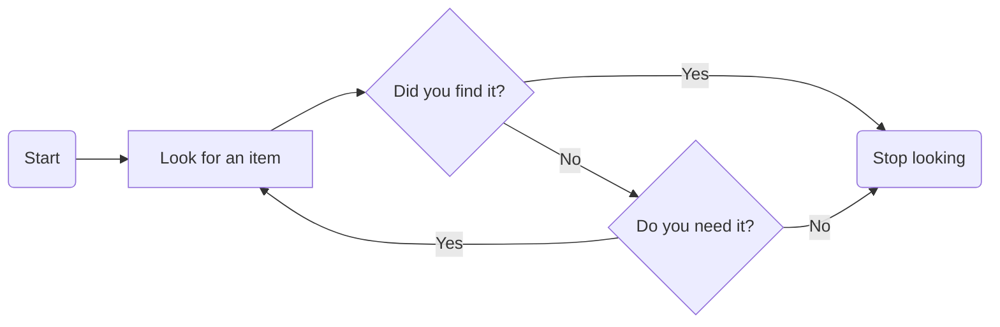
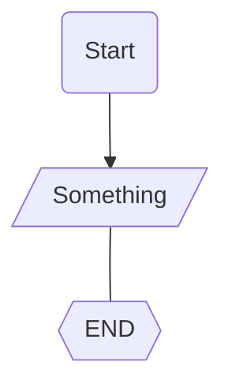
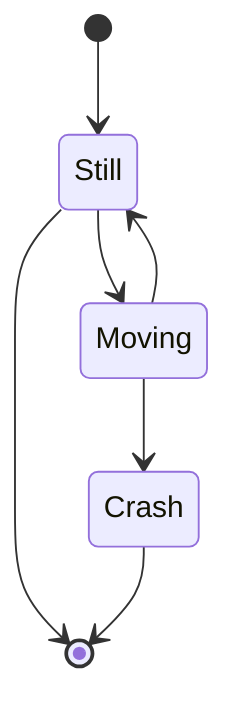
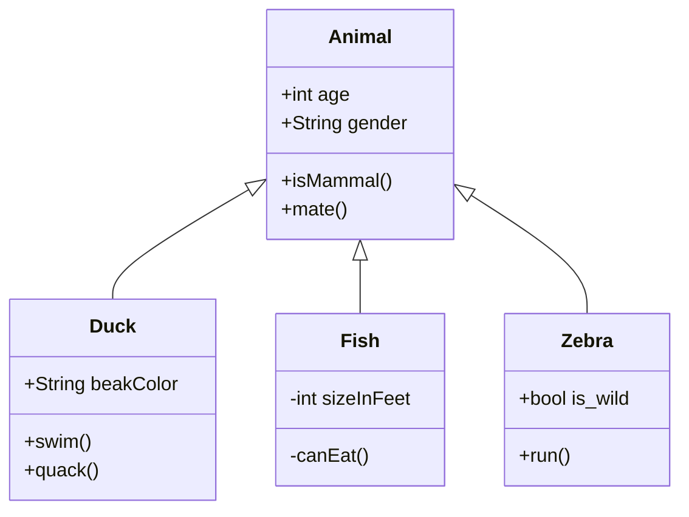
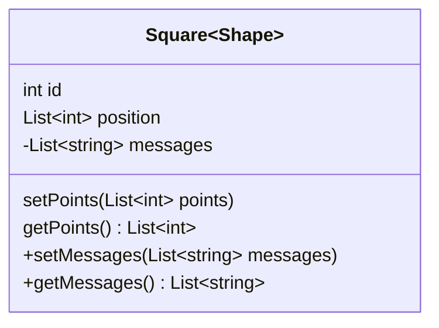
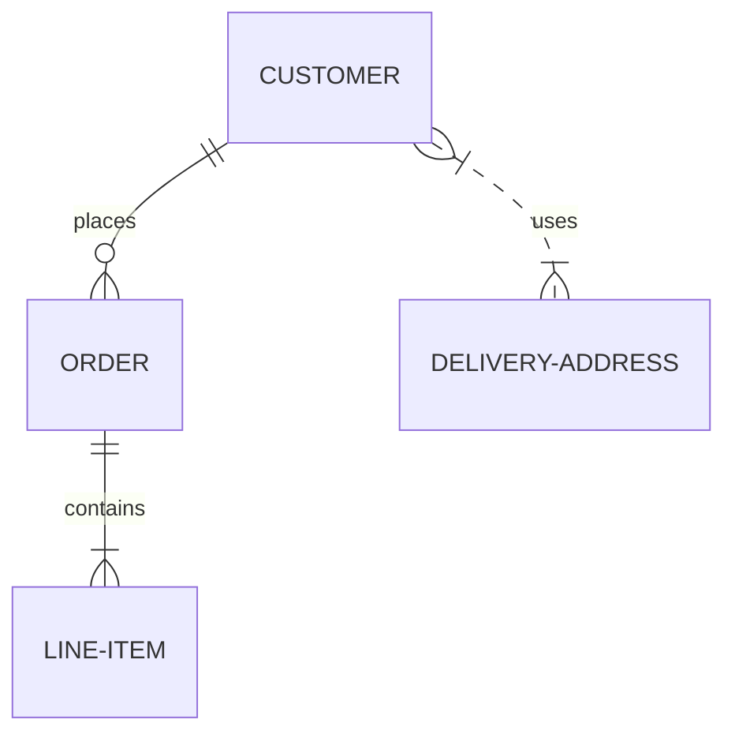

# Mermaid

---

+ [Mermaid](https://mermaid-js.github.io/mermaid/#/)
+ [Live Editor](https://mermaid-js.github.io/mermaid-live-editor/)
+ [Markdown](https://www.markdownguide.org/basic-syntax/)
+ [Markdown Extended](https://www.markdownguide.org/extended-syntax/)
+ [Mermaid Editor](https://marketplace.visualstudio.com/items?itemName=tomoyukim.vscode-mermaid-editor)
+ [SVG Viewer](https://marketplace.visualstudio.com/items?itemName=cssho.vscode-svgviewer)
+ [Jira Feature Request](https://jira.atlassian.com/browse/BCLOUD-18559)

---

## Sequence Diagram

## Flowchart

## State Diagrams

## Class Diagram

## Entity Relationship Diagrams

